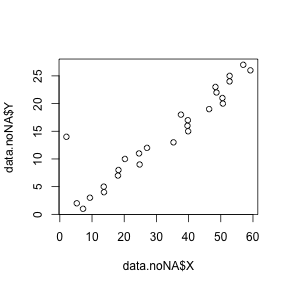

# Data Processing

File to make cleaned data file from raw data file.

**Read CSV**


```r
rawdata <- read.csv("data/raw.csv")
head(rawdata,n = 3)
```

```
##          X Y
## 1 7.214992 1
## 2 5.266567 2
## 3 9.359408 3
```

**Clean up**

1. Remove NAs
2. Remove outliers


```r
# Remove missing values in X column
data.noNA <- rawdata[! is.na(rawdata$X),]
```

Plot data to check for outliers


```r
plot(x = data.noNA$X, y = data.noNA$Y)
```



Remove outliers


```r
cleandata <- data.noNA[data.noNA$Y!=14,]
```

Spun with:
